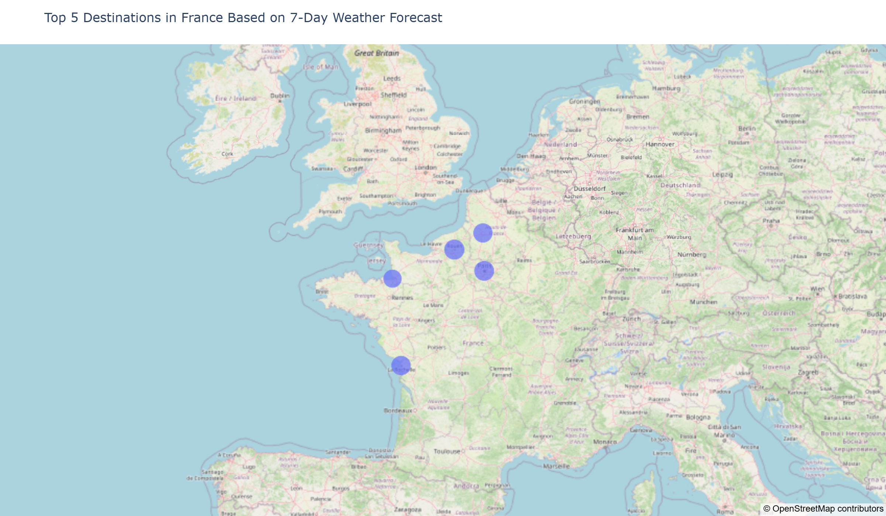
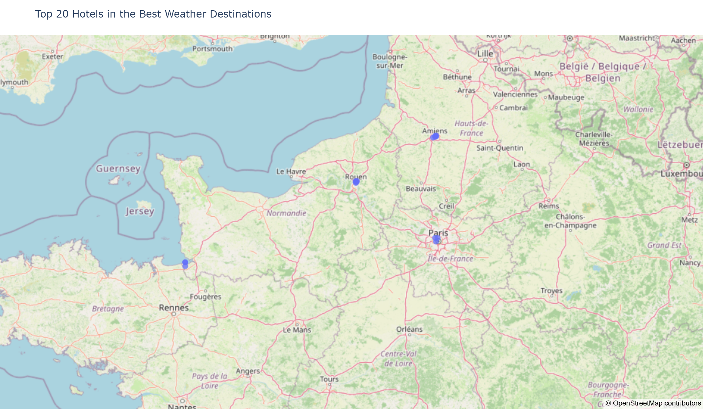

# Kayak — Weather & Hotel Recommendation Data Pipeline

End-to-end data engineering project developed as part of the **Jedha Data Science & Engineering certification**.

The objective of this project is to build a data pipeline that identifies the best destinations to visit in France based on upcoming weather conditions and recommends highly rated hotels in those destinations.

The project combines data collection from APIs and web scraping, data transformation, cloud storage with AWS S3, a PostgreSQL database hosted on AWS RDS, and interactive geographic visualizations with Plotly.

---

## Project Objective

Kayak is a travel search engine that helps users plan their trips.

For this project, the goal is to create a recommendation system based on weather forecasts and hotel information for **35 French destinations**.

The pipeline:

1. Retrieves geographic coordinates for 35 destinations.
2. Collects a 7-day weather forecast for each destination.
3. Calculates a weather score and identifies the 5 most attractive destinations.
4. Scrapes hotel information from Booking.com for those destinations.
5. Stores raw and processed datasets in an AWS S3 data lake.
6. Loads the relevant datasets into a PostgreSQL database hosted on AWS RDS.
7. Queries the database to produce interactive maps of the best destinations and hotels.

---

## Data Pipeline

```text
35 French destinations
        │
        ▼
Nominatim API
Geographic coordinates
        │
        ▼
OpenWeather API
7-day weather forecast
        │
        ▼
Weather analytics
Weather score & ranking
        │
        ▼
Top 5 destinations
        │
        ▼
Booking.com
Hotel scraping with Playwright
        │
        ▼
Data cleaning
        │
        ▼
AWS S3
Data Lake
        │
        ▼
ETL
        │
        ▼
AWS RDS
PostgreSQL
        │
        ▼
SQL queries
        │
        ▼
Plotly visualizations
Top 5 destinations & Top 20 hotels
```

---

## Destinations

The analysis covers the following 35 destinations in France:

* Mont Saint Michel
* St Malo
* Bayeux
* Le Havre
* Rouen
* Paris
* Amiens
* Lille
* Strasbourg
* Chateau du Haut Koenigsbourg
* Colmar
* Eguisheim
* Besancon
* Dijon
* Annecy
* Grenoble
* Lyon
* Gorges du Verdon
* Bormes les Mimosas
* Cassis
* Marseille
* Aix en Provence
* Avignon
* Uzes
* Nimes
* Aigues Mortes
* Saintes Maries de la mer
* Collioure
* Carcassonne
* Ariege
* Toulouse
* Montauban
* Biarritz
* Bayonne
* La Rochelle

---

## 1. Geographic Data Collection

The first step retrieves the latitude and longitude of each destination using the **Nominatim geocoding API**.

Each destination receives a unique `city_id`.

The resulting dataset is stored as:

```text
data/raw/cities_coordinates.csv
```

---

## 2. Weather Data Collection

Weather forecasts are collected using the **OpenWeather One Call API**.

For every destination, the pipeline retrieves daily weather information for the next 7 days.

The weather dataset contains information such as:

* temperature
* precipitation
* probability of precipitation
* humidity
* wind speed
* weather conditions

The resulting dataset is stored as:

```text
data/raw/weather_daily_7days.csv
```

---

## 3. Weather Analytics

The weather data is aggregated at destination level to determine which destinations offer the most favorable conditions during the upcoming week.

The scoring methodology considers several weather indicators, including:

* average daytime temperature
* total rainfall
* probability of precipitation
* average wind speed
* average humidity

Favorable temperatures increase the score, while rain, wind and unfavorable humidity conditions reduce it.

The destinations are ranked according to their final weather score.

Processed datasets are stored in:

```text
data/processed/city_weather_ranking.csv
data/processed/top_5_destinations.csv
```

The five highest-ranked destinations are then used for the hotel search.

---

## 4. Hotel Data Collection

Hotel information is collected from **Booking.com** for the five selected destinations.

Because Booking.com dynamically renders its search results, the scraping pipeline uses **Playwright** with a Chromium browser.

The scraper collects information including:

* hotel name
* Booking.com URL
* rating
* description
* latitude
* longitude
* associated destination

The raw hotel dataset is stored in:

```text
data/raw/booking_data.csv
```

After cleaning, the final hotel dataset is stored in:

```text
data/processed/hotels_cleaned.csv
```

Missing ratings are preserved as missing values rather than artificially replaced with a score.

---

## 5. AWS S3 Data Lake

The datasets are uploaded to an **Amazon S3** bucket.

The bucket follows a simple raw/processed structure:

```text
raw/
├── cities_coordinates.csv
├── weather_daily_7days.csv
└── booking_data.csv

processed/
├── city_weather_ranking.csv
├── top_5_destinations.csv
└── hotels_cleaned.csv
```

The S3 bucket is private and AWS credentials are managed through environment variables.

No AWS credentials are stored in this repository.

---

## 6. PostgreSQL Data Warehouse — AWS RDS

The project uses a **PostgreSQL database hosted on Amazon RDS**.

The ETL pipeline reads datasets from S3 and loads them into PostgreSQL.

The main SQL tables used for the final analysis are:

```text
hotels
weather
top_5_destinations
```

The visualization notebook queries the RDS database directly rather than relying only on local CSV files.

This demonstrates the complete pipeline:

```text
S3 → ETL → RDS PostgreSQL → SQL → Pandas → Plotly
```

---

## 7. Interactive Visualizations

The final stage uses **Plotly** to create interactive geographic visualizations.

### Top 5 Destinations

The first map displays the five destinations with the highest weather scores based on the 7-day forecast.

Output:

```text
data/outputs/top_5_destinations.html
```

### Top 20 Hotels

Hotels from the selected destinations are ranked using their Booking.com ratings.

Hotels without a rating are excluded from the ranking, and the 20 highest-rated hotels with valid geographic coordinates are displayed on an interactive map.

Output:

```text
data/outputs/top_20_hotels.html
```

The corresponding Top 20 dataset is also exported to:

```text
data/outputs/top_20_hotels.csv
```

---

## Repository Structure

```text
jedha-kayak-project/
│
├── README.md
├── requirements.txt
├── .gitignore
│
├── notebooks/
│   ├── 01_Get_Coordinates.ipynb
│   ├── 02_Get_Weather.ipynb
│   ├── 03_Weather_Analytics.ipynb
│   ├── 04_Booking_Scraping.ipynb
│   ├── 05_ETL_S3_RDS.ipynb
│   └── 06_Visualization.ipynb
│
├── scripts/
│   └── booking_scraper.py
│
└── data/
    ├── raw/
    │   ├── cities_coordinates.csv
    │   ├── weather_daily_7days.csv
    │   └── booking_data.csv
    │
    ├── processed/
    │   ├── city_weather_ranking.csv
    │   ├── top_5_destinations.csv
    │   └── hotels_cleaned.csv
    │
    └── outputs/
        ├── top_5_destinations.html
        ├── top_20_hotels.html
        └── top_20_hotels.csv
```

---

## Technologies Used

* Python
* Pandas
* NumPy
* Requests
* Nominatim API
* OpenWeather API
* Playwright
* Booking.com
* Boto3
* AWS S3
* AWS RDS
* PostgreSQL
* SQLAlchemy
* Plotly
* Jupyter Notebook
* Git / GitHub

---

## Installation

Clone the repository:

```bash
git clone https://github.com/AlexandraBelj/jedha-kayak-project.git
cd jedha-kayak-project
```

Install the Python dependencies:

```bash
pip install -r requirements.txt
```

Install the Chromium browser required by Playwright:

```bash
playwright install chromium
```

---

## Environment Variables

API keys, AWS credentials and database credentials are stored locally in a `.env` file.

The `.env` file is excluded from Git through `.gitignore` and must **never be committed to GitHub**.

The project expects environment variables such as:

```text
OPENWEATHER_API_KEY

AWS_ACCESS_KEY_ID
AWS_SECRET_ACCESS_KEY
AWS_REGION
S3_BUCKET_NAME

RDS_HOST
RDS_PORT
RDS_DB
RDS_USER
RDS_PASSWORD
```

Replace these with your own credentials when running the project.

---

## Running the Project

The notebooks are organized according to the different stages of the pipeline and should be executed in the following order:

```text
01_Get_Coordinates.ipynb
        ↓
02_Get_Weather.ipynb
        ↓
03_Weather_Analytics.ipynb
        ↓
04_Booking_Scraping.ipynb
        ↓
05_ETL_S3_RDS.ipynb
        ↓
06_Visualization.ipynb
```

The Booking.com scraping stage also relies on the Python scraper located in the `scripts/` directory.

---

## Security

Sensitive information is never stored directly in the source code.

The following information is managed through environment variables and excluded from version control:

* OpenWeather API key
* AWS Access Key ID
* AWS Secret Access Key
* RDS database password

The S3 bucket is configured without public access.

---

## Results & Visualizations

### Top 5 Destinations

The destinations are ranked according to their 7-day weather forecast using temperature, rainfall, precipitation probability, wind speed, and humidity.



[View interactive Top 5 destinations map](data/outputs/top_5_destinations.html)

### Top 20 Hotels

The highest-rated hotels from the selected destinations are displayed on an interactive map.



[View interactive Top 20 hotels map](data/outputs/top_20_hotels.html)


## Conclusion

This project implements an end-to-end data engineering workflow for travel recommendations.

It combines:

* API data collection
* browser-based web scraping
* data cleaning and transformation
* weather-based destination ranking
* cloud data storage
* ETL processing
* SQL data warehousing
* interactive data visualization

The resulting pipeline identifies destinations with favorable weather conditions and recommends highly rated hotels within those destinations.

The project demonstrates how multiple data sources and cloud services can be combined into a reproducible data pipeline from ingestion to final visualization.
